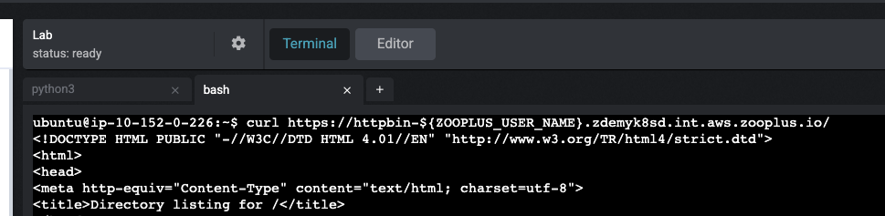

# Next Steps

In this lesson you will steal traffic from the remote `httpbin` service to a local HTTP server using mirrord.

---

## 1. Create `mirrord.json`

```bash
cat <<EOF2 >> mirrord.json
{
  "feature": {
    "network": {
      "incoming": {
        "mode": "steal",
        "port_mapping": [[8080, 80]]
      },
      "outgoing": true
    },
    "fs": "read",
    "env": true
  }
}
EOF2
```

## 2. Run local Python HTTP server with mirrord

```bash
mirrord exec -f mirrord.json \
  --target deployment/${ZOOPLUS_USER_NAME}-zp-app-httpbin \
  -n product-zoodemy-k8s-training-6 \
  python3 -- -m http.server 8080
```

Wait until the server reports it has started.

## 3. Call the remote service

In another terminal tab:

```bash
curl https://httpbin-${ZOOPLUS_USER_NAME}.zdemyk8sd.int.aws.zooplus.io/
```

Instead of the normal httpbin UI you should see a **directory listing** from your local Python server.



---

## 4. Cleanup

```bash
helm delete ${ZOOPLUS_USER_NAME}-zp-app -n product-zoodemy-k8s-training-6
```

---

## 5. Next steps

After the lab you can continue with mirrord on your own machine using your internal wiki guides and the **#mirrord-support** Slack channel.
